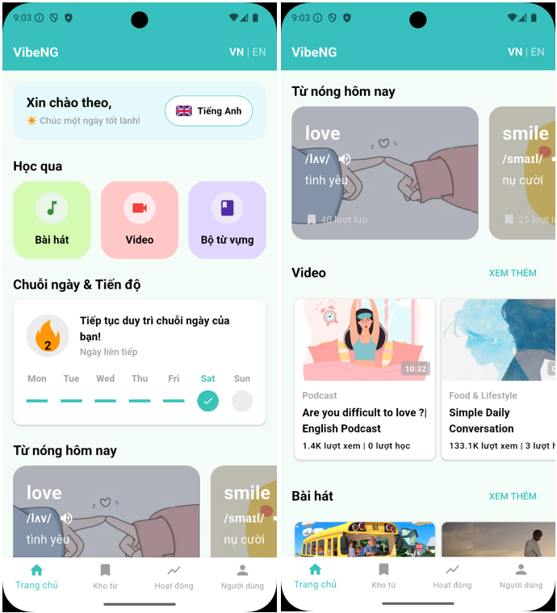
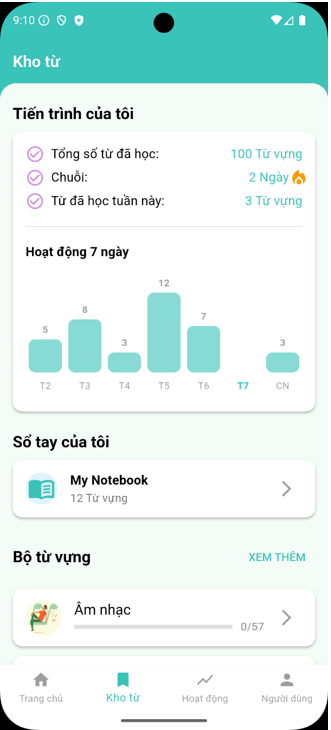
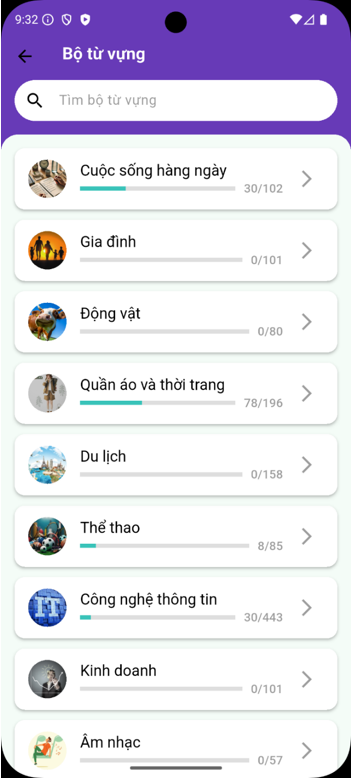
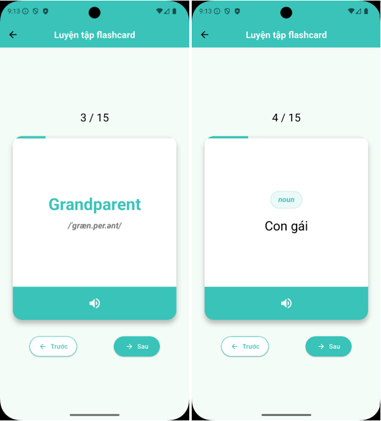
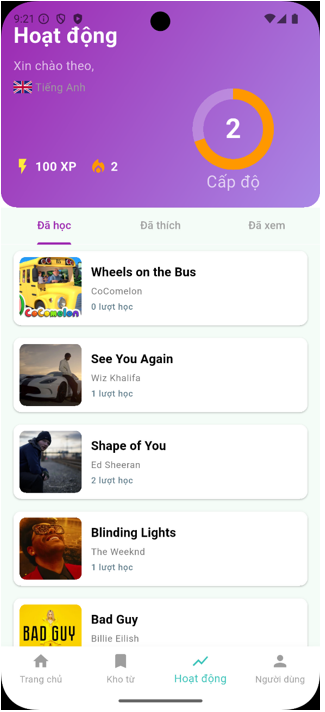
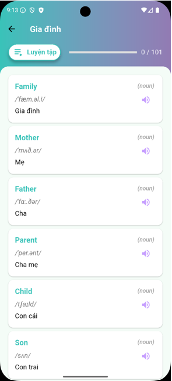
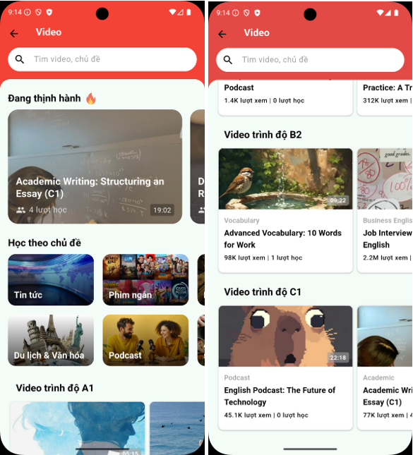
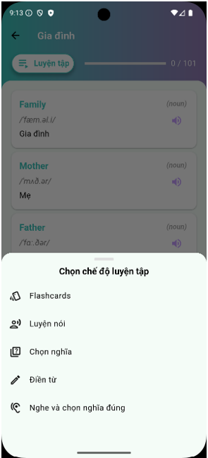
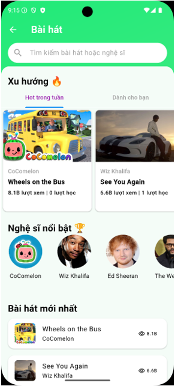

# VibeNG

VibeNG là ứng dụng học từ vựng tiếng Anh đa phương tiện, phát triển bằng Flutter, hướng tới trải nghiệm học tập chủ động, thú vị và cá nhân hóa. Ứng dụng hoạt động hoàn toàn offline, sử dụng dữ liệu mẫu lưu trữ dưới dạng JSON trong thư mục assets.

## Giới thiệu
VibeNG giúp người học tiếp cận từ vựng tiếng Anh qua nhiều hình thức: xem video, nghe nhạc, luyện tập với flashcards, và ôn tập theo các bộ từ chủ đề. Ứng dụng phù hợp cho sinh viên, người tự học, hoặc bất kỳ ai muốn cải thiện vốn từ vựng một cách tự nhiên, đều đặn.

## Tính năng nổi bật
- **Học từ vựng qua video và bài hát:** Kết hợp nội dung giải trí với học tập, giúp ghi nhớ từ vựng trong ngữ cảnh thực tế.
- **Flashcards & luyện tập:** Ôn tập nhanh với flashcards, các chế độ luyện tập sẽ được mở rộng thêm (trắc nghiệm, luyện nói, nghe chọn nghĩa...).
- **Kho bộ từ theo chủ đề:** Dễ dàng chọn chủ đề phù hợp, theo dõi tiến độ từng bộ từ.
- **Theo dõi tiến độ học:** Hiển thị tổng số từ đã học, streak ngày liên tục, biểu đồ hoạt động 7 ngày gần nhất (fl_chart).
- **Đa ngôn ngữ:** Hỗ trợ tiếng Việt và tiếng Anh, chuyển đổi nhanh trên giao diện.
- **Giao diện hiện đại, dễ dùng:** Thiết kế trực quan, tối ưu cho cả điện thoại và máy tính bảng.
- **Dữ liệu offline:** Không cần internet, toàn bộ dữ liệu mẫu nằm trong `assets/data` (songs.json, videos.json, vocab_sets.json, ...).

## Kiến trúc tổng quan
- **UI (lib/screens):** Các màn hình chính như Home, Kho từ, Hoạt động, Hồ sơ người dùng.
- **Widgets (lib/widgets):** Các thành phần giao diện tái sử dụng (BottomNavBar, WelcomeCard, SectionHeader, ...).
- **Repositories (lib/repositories):** Lớp trung gian lấy dữ liệu từ file JSON (dùng rootBundle.loadString), dễ mở rộng sang backend hoặc database thật.
- **Models (lib/models):** Định nghĩa cấu trúc dữ liệu (VocabSetModel, WordDetailModel, SongModel, ...).
- **Localization (l10n):** Đa ngôn ngữ với file arb, lớp AppLocalizations.
- **Điều hướng:** BottomNavBar chia 4 khu vực: Home, Kho từ, Hoạt động, Người dùng.

## Hình ảnh giao diện

<table align="center">
	<tr>
		<td></td>
		<td></td>
		<td></td>
	</tr>
	<tr>
        <td></td>
		<td></td>
		<td></td>
	</tr>
	<tr>
        <td></td>
		<td></td>
		<td></td>
	</tr>
</table>

## Hướng dẫn cài đặt & chạy thử
1. Cài đặt [Flutter SDK](https://docs.flutter.dev/get-started/install) (>=3.9.2).
2. Clone repo về máy:
	 ```sh
	 git clone <repo-url>
	 cd 2025_LTTBDD_N04_Nhom_ThaoViet
	 flutter pub get
	 flutter run
	 ```
3. Không cần cấu hình backend, chỉ cần Flutter SDK và thiết bị/emulator.

## Thư mục dữ liệu mẫu
- `assets/data/songs.json` – Danh sách bài hát mẫu
- `assets/data/videos.json` – Danh sách video mẫu
- `assets/data/vocab_sets.json` – Danh sách bộ từ vựng
- `assets/data/vocab_set_<id>.json` – Từ vựng chi tiết từng bộ
- `assets/data/hotday_words.json` – Từ vựng nổi bật
- `assets/data/steaks.json` – Thông tin người dùng mẫu

## Đóng góp & phát triển
- Có thể mở rộng thêm các chế độ luyện tập (trắc nghiệm, luyện nói, nghe chọn nghĩa, ...).
- Dễ dàng tích hợp backend (REST API, Firestore, SQLite, ...) nhờ kiến trúc tách lớp.
- Có thể bổ sung lưu tiến độ học, cá nhân hóa, bảng xếp hạng, v.v.

